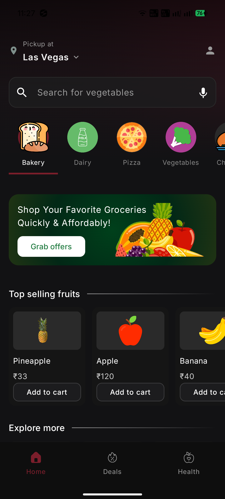
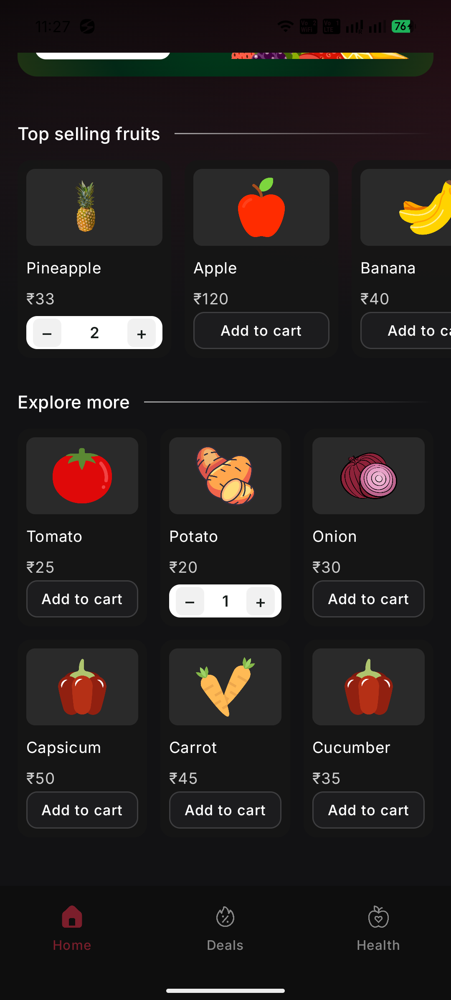

# 🛒 GroceryAppUI-Compose

A **Grocery App Home Screen UI** built using **Jetpack Compose**.  
This project is created as a **UI practice implementation** to explore modern Android UI development with Compose.

---

## ✨ About the Project

This repository contains a **dummy first screen UI** of a grocery application.  
The goal of this project is to practice **Jetpack Compose**, understand composable layouts, and experiment with UI design and structure.

It focuses on building a clean, modern grocery-style interface using Compose components.

---

## 📸 Screenshot





---

## 🧩 UI Overview

The screen includes common grocery app UI elements such as:

- Header / top section
- Category-style UI blocks
- Product-style cards
- Modern Compose layout patterns

This screen serves as a **UI reference and practice layout**.

---

## 🛠 Tech Stack

- **Kotlin**
- **Jetpack Compose**
- **Material Design**
- **Android Studio**

---

## 📂 Use Case

This project can be used for:

- Practicing Jetpack Compose
- Learning UI composition
- UI prototyping
- Grocery app UI reference
- Compose layout experimentation

---

## 🚀 Getting Started

```bash
git clone https://github.com/kotakvishal/GroceryAppUI-Compose.git
